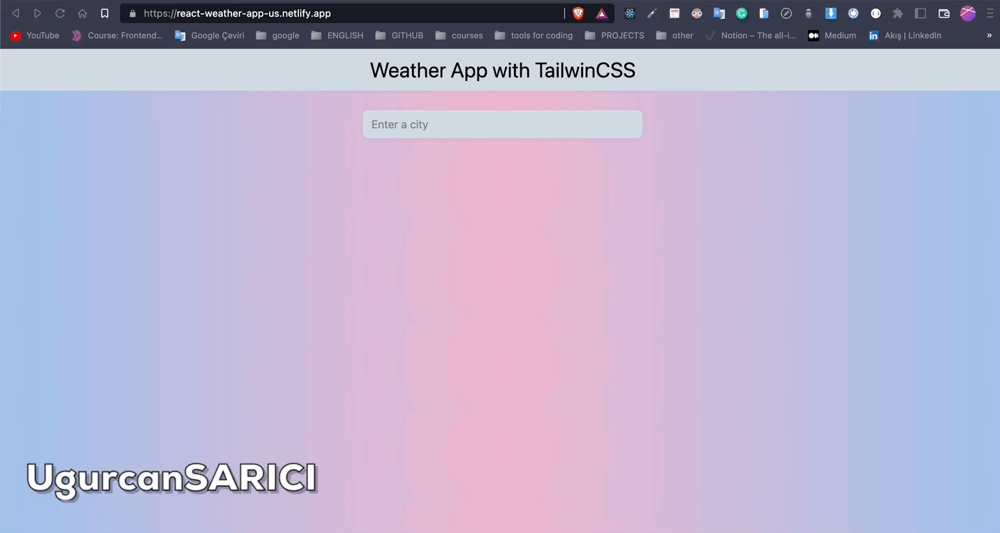

# Project : Weather App

## Table of contents

  - [The challenge](#the-challenge)
  - [Screenshot](#screenshot)
  - [Project Skeleton ](#project-skeleton)
  - [Links](#links)
  - [Built with](#built-with)
  - [Useful resources](#useful-resources)


## The challenge
Project aims to create a Weather App with React and Tailwindcss

## Problem Statement

- Develop a weather app to improve your REACT knowledge and practice with tailwindcss
<hr>


## Project Skeleton 

```
checkout-website(folder)

|----README.md                   
|----public(folder)                    
|----src(folder)
|----package.json
|----weather.gif
|----yarn.lock

```

## Screenshot
<p align="center">
<a href="https://react-weather-app-us.netlify.app/"></a>
</p>


## Links
<hr>
<b>Check The Live Website ➡️</b> <a href="https://react-weather-app-us.netlify.app/">Live Website</a>
<hr>

### Built with

- JS Dom , setInterval , getHours, getMinutes, getSeconds

- JS getElementById, querySelector,

- Semantic HTML5 markup

- CSS custom properties

- CSS Colors-Border Properties

- CSS Margins-Padding

- CSS Properties for Texts-Font Families-Links


## Notes

- You can use HTML,CSS and JAVASCRIPT to complete this project.

### Useful resources

- [W3 Schoold](https://www.w3schools.com/) 
- [MDN](https://developer.mozilla.org/en-US/) 


<center> &#8987; Happy Coding  &#9997; </center>
